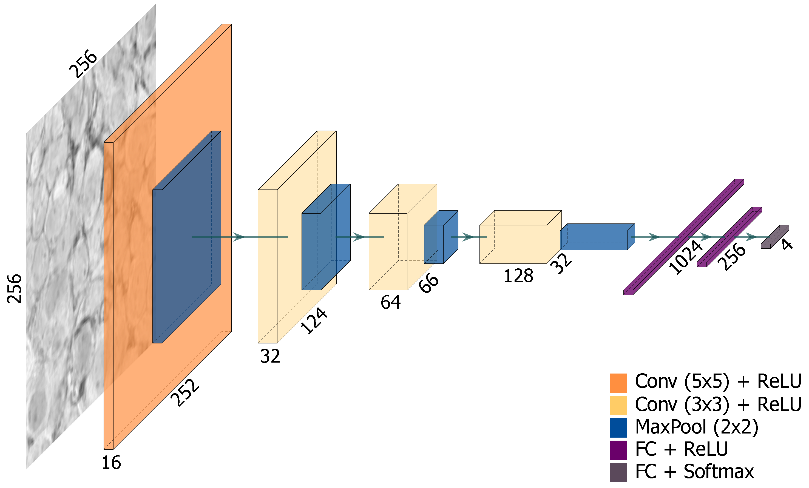
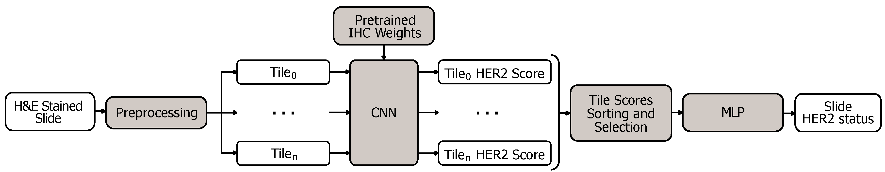

# Weakly-Supervised Classification of HER2 Expression in Breast Cancer Haematoxylin and Eosin Stained Slides
## About
Implementation of the paper [_"Weakly-Supervised Classification of HER2 Expression in Breast Cancer Haematoxylin and Eosin Stained Slides"_](https://www.mdpi.com/2076-3417/10/14/4728), by Sara P. Oliveira, João Ribeiro Pinto, Tiago Gonçalves, Rita Canas-Marques, Maria J. Cardoso, Hélder P. Oliveira and Jaime S. Cardoso.
## Abstract
Human epidermal growth factor receptor 2 (HER2) evaluation commonly requires immunohistochemistry (IHC) tests on breast cancer tissue, in addition to the standard haematoxylin and eosin (H&E) staining tests. Additional costs and time spent on further testing might be avoided if HER2 overexpression could be effectively inferred from H&E stained slides, as a preliminary indication of the IHC result. In this paper, we propose the first method that aims to achieve this goal. The proposed method is based on multiple instance learning (MIL), using a convolutional neural network (CNN) that separately processes H&E stained slide tiles and outputs an IHC label. This CNN (Fig. 1) is pretrained on IHC stained slide tiles but does not use these data during inference/testing. H&E tiles are extracted from invasive tumour areas segmented with the HASHI algorithm. The individual tile labels are then combined to obtain a single label for the whole slide. The network was trained on slides from the HER2 Scoring Contest dataset (HER2SC) and tested on two disjoint subsets of slides from the HER2SC database and the TCGA-TCIA-BRCA (BRCA) collection. The proposed method (Fig. 2) attained __83.3%__ classification accuracy on the HER2SC test set and __53.8%__ on the BRCA test set. Although further efforts should be devoted to achieving improved performance, the obtained results are promising, suggesting that it is possible to perform HER2 overexpression classification on H&E stained tissue slides.


Fig. 1 - Architecture of the implemented convolutional neural network.


Fig. 2 - The proposed approach for weakly-supervised HER2 status classification on BCa H&E stained slides.

## Clone this repository
To clone this repository, open a Terminal window and type:
```bash
$ git clone https://github.com/spoliveira/HERclassHE.git
```
Then go to the repository's main directory:
```bash
$ cd HERclassHE
```
## Dependencies
Please be sure that you have (at least) the following Python packages installed:
```
Package Name             Version            

cudatoolkit               9.2               
ghalton                   0.6.1                           
numpy                     1.16.3           
opencv                    4.1.0          
openslide                 3.4.1              
openslide-python          1.1.1              
pillow                    5.4.1        
python                    3.7.2           
pytorch                   1.0.1           
scikit-image              0.15.0           
scikit-learn              0.21.1          
scipy                     1.2.1            
torchvision               0.2.1
```
Or you can create a virtual Python environment (Python 3.7) and run:
```bash
$ pip install -r requirements.txt
```
### Troubleshooting: Installation of the Dependencies
Please read these notes before installing the dependencies manually or through the ["requirements.txt"](requirements.txt).
#### OpenSlide
According to the [OpenSlide PyPi Page](https://pypi.org/project/openslide-python/), before the installation of the OpenSlide Python API, you should install the OpenSlide package for your OS. You can find instructions [here](https://openslide.org/download/) (Linux or macOS only). 

Then, to avoid problems with __setuptools__ in Python, you should proceed as follows:
```bash
$ pip install setuptools==45
```

And finally:
```bash
$ pip install openslide-python
```
#### Ghalton
To install [Ghalton](https://github.com/fmder/ghalton), you need to [install Swig first](https://www.dev2qa.com/how-to-install-swig-on-macos-linux-and-windows/). Then, you may run:
```bash
$ pip install ghalton
```
## Data & Models' Files
### Data
The dataset is composed of subsets of whole-slide images (WSI) from two public datasets: the [HER2 Scoring Contest](https://warwick.ac.uk/fac/sci/dcs/research/tia/her2contest/) training set and the [TCGA-TCIA-BRCA collection](https://wiki.cancerimagingarchive.net/display/Public/TCGA-BRCA).
### Models' Files
The models' weights files are publicly available and can be donwloaded [__here__](https://drive.google.com/drive/folders/1MXBW8onOz_Hi7f5JBdGFja8PzHx9gM30?usp=sharing). Download the Google Drive folder __"authors_models"__ and transfer all its contents to this repository's [__"authors_models"__](authors_models/) directory.

## Usage
We advise you to read the [full paper](https://www.mdpi.com/2076-3417/10/14/4728) to understand which task may fit your purposes or if you want to replicate our work.
### 1. Data Pre-processing
#### 1.1 Inference Only (HE Images)
To perform inference-only on HE images you need to go to the ["preprocessing"](preprocessing/) directory:
```bash
$ cd preprocessing
```
Open ["HASHI_segmentation.py"](preprocessing/HASHI_segmentation.py) on your IDE, and edit the following variables:
```python
# --- Data directories ---
dir_slides = ''                 # path with all the slides, in this case, you should put here the path to HE images slides
dir_thumbnails = ''             # path where segmentation masks will be stored (reduced size)
```
This file is used to generate tumour segmentation masks. To run this script, type:
```bash
$ python HASHI_segmentation.py
```
Then, open ["wsi_main.py"](preprocessing/wsi_main.py) on your IDE, and edit the following variables:
```python
# --- Data directories ---
dir_slides = ''         # path with all the slides, in this case, you should put here the path to HE images slides
dir_patches = ''        # path where .pkl files will be stored (one file per slide containing [patches, coord, label(IHC score), bin_label(IHC status)])
dir_thumbnails = ''     # path where thumbnails will be stored (img/otsu masks)
dir_masks = ''          # annotation masks location (if there are annotation mask files)
labels_file = ''        # .csv file with labels (structure: slide_name, IHC score (4 classes), IHC status (2 classes))
```
This file is used to generate the _.pickle_ files that contain the tiles that will be used. To run this script, type:
```bash
$ python wsi_main.py
```
#### 1.2 Training (HER2/HE Images)
To train the model according to the paper you need to go to the ["preprocessing"](preprocessing/) directory, as explained above:
```bash
$ cd preprocessing
```
Open ["HASHI_segmentation.py"](preprocessing/HASHI_segmentation.py) on your IDE, and edit the following variables, for the HE images:
```python
# --- Data directories ---
dir_slides = ''                 # path with all the slides, in this case, you should put here the path to HE images slides
dir_thumbnails = ''             # path where segmentation masks will be stored (reduced size)
```
To run this script, type:
```bash
$ python HASHI_segmentation.py
```
Then, open ["wsi_main.py"](preprocessing/wsi_main.py) on your IDE, and edit the following variables:
```python
# --- Data directories ---
dir_slides = ''         # path with all the slides, in this case, you should put here the path to HE and/or HER2 images slides
dir_patches = ''        # path where .pkl files will be stored (one file per slide containing [patches, coord, label(IHC score), bin_label(IHC status)])
dir_thumbnails = ''     # path where thumbnails will be stored (img/otsu masks)
dir_masks = ''          # annotation masks location (if there are annotation mask files)
labels_file = ''        # .csv file with labels (structure: slide_name, IHC score (4 classes), IHC status (2 classes))
```
Please note that you will have to run this twice: one execution for the HE images and another for the HER2 images:
```bash
$ python wsi_main.py
```
Then, open ["gen_class_pik.py"](preprocessing/gen_class_pik.py) on your IDE and edit the following variables:
```python
data_path = ''   # path with HER2 .pkl files per IHC slide
classes = 2      # number of classes to combine (according IHC status, 2 classes, or IHC score, 4 classes; default: 2 classes)
```
### 2. Model Training & Test
#### 2.1 Model Inference-Only (HE Images)
If you want to perform inference-only on HE images, you have to open ["model_test_inference.py"](model_test_inference.py) on your IDE and edit the following variables:
```python
# --- Data directories ---
data_path = ''           # path with test/inference .pkl files (per slide) with HE tiles

# --- Hyperparameters ---
AGGREGATION = 'mean'     # aggregation method ('mlp', 'mean' or 'median')
cnn_file = ''            # correspondent model file

# MORE INFORMATION BELOW 
# "mean-median_pretrained_IHCweights.pth.tar" for mean or median with pretrained IHC weights
# "mean-median_wOUT_pretrained_IHCweights.pth.tar" for mean or median without pretrained IHC weights
# "proposed_model_wOUT_pretrained_IHCweights.pth.tar" for our proposed mlp without pretrained IHC weights
# "proposed_model.pth.tar" for our proposed model
```
Then, assuming that you are in the project root directory, run the script:
```python
$ python model_test_inference.py
```
#### 2.2 Model Training
To perform the model training according to the paper, you need to open ["cnn_ihc.py"](cnn_ihc/cnn_ihc.py) on your IDE and edit the following variables:
```python
# --- Data directories ---
train_path = ''       # path with train HER2 .pkl files (per class) with IHC tiles
val_path = ''         # path with validation .pkl files (per class) with IHC tiles

# --- Hyperparameters ---
DEVICE = 'cuda:0' if torch.cuda.is_available() else 'cpu'  # gpu to use
N_EPOCHS = 200                                             # number of training epochs (default: 200)
BATCH_TILE = 128                                           # number of tiles per batch (default: 128)
```
Then, to run, you need to go the ["cnn_ihc"](cnn_ihc) directory first:
```bash
$ cd cnn_ihc
```
And run the script:
```bash
$ python cnn_ihc.py
```
The end of the execution of this script will generate a model file, similar to the ["IHC-HER2_model.tar"](authors_models/IHC-HER2_model.tar). So, if you want to skip this step, you can just use ours in the next step.

After, open the ["model_train.py"](model_train.py) file on your IDE and edit the following variables:
```python
# --- Data directories ---
train_path = ''        # path with train HER2/HE .pkl files (per slide) with HE tiles
val_path = ''          # path with HER2/HE validation .pkl files (per slide) with HE tiles

# --- Hyperparameters ---
DEVICE = 'cuda:0' if torch.cuda.is_available() else 'cpu'   # gpu to use
N_EPOCHS = 150                                              # number of training epochs  (default: 150)
BATCH_TILE = 300                                            # number of tiles to select per slide (default: 300)
IMGS_STEP = 2                                               # number of slides to accumulate after backprop (default: 2)
AGGREGATION = 'mlp'                                         # aggregation method ('mlp', 'mean' or 'median')
PRETRAIN = True                                             # use/not use IHC-HER2 pretrained CNN weights
cnn_file = './authors_models/IHC-HER2_model.tar'            # file with IHC-HER2 pretrained CNN weights or the one that you obtained in the previous step. Only use this if PRETRAIN = TRUE
```
## Citation
If you use this repository in your research work, please cite this paper:
```bibtex
@article{oliveira2020weakly,
  title={Weakly-Supervised Classification of HER2 Expression in Breast Cancer Haematoxylin and Eosin Stained Slides},
  author={Oliveira, Sara P and Ribeiro Pinto, Jo{\~a}o and Gon{\c{c}}alves, Tiago and Canas-Marques, Rita and Cardoso, Maria-Jo{\~a}o and Oliveira, H{\'e}lder P and Cardoso, Jaime S},
  journal={Applied Sciences},
  volume={10},
  number={14},
  pages={4728},
  year={2020},
  publisher={Multidisciplinary Digital Publishing Institute}
}
```
## Funding & Acknowledgments
### Funding
This work was partially funded by the Project “CLARE: Computer-Aided Cervical Cancer Screening” (POCI-01-0145-FEDER-028857), financially supported by FEDER through Operational Competitiveness Program–COMPETE 2020 and by National Funds through the Portuguese funding agency, FCT–Fundação para a Ciência e a Tecnologia, and also the FCT PhD grants “SFRH/BD/139108/2018” and “SFRH/BD/137720/2018”.
### Acknowledgments
The results published here are in whole or part based upon data generated by the [TCGA Research Network](https://cancergenome.nih.gov/) and the [HER2 Scoring Contest](https://warwick.ac.uk/fac/sci/dcs/research/tia/her2contest).
## Feedback & Suggestions
If you have any doubts, feedback or suggestions feel free to contact [sara.i.oliveira@inesctec.pt](mailto:sara.i.oliveira@inesctec.pt) or create an issue/pull request.
